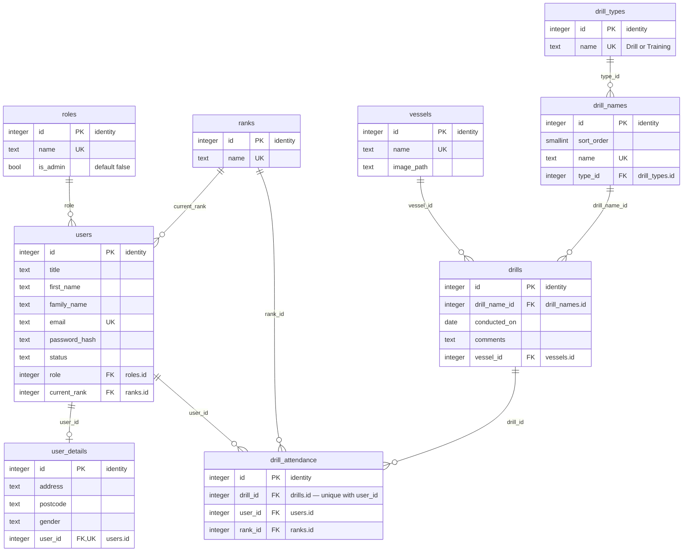

# Database Design

`drill_attendance` has a composite `UNIQUE (drill_id, user_id)` so a person can only be recorded once per drill.

## Tables

| Table            | Purpose                                                | Key fields                                          |
| ---------------- | ------------------------------------------------------ | --------------------------------------------------- |
| users            | Crew and staff                                         | role → roles, current_rank → ranks                  |
| user_details     | Personal details, one row per user                     | user_id → users                                     |
| roles            | User roles                                             |                                                     |
| ranks            | Shipboard ranks                                        |                                                     |
| vessels          | Ships                                                  |                                                     |
| drill_types      | Drill (practical) or Training (classroom)              |                                                     |
| drill_names      | Each drill or course (Fire, Abandon Ship, ...)         | type_id → drill_types                               |
| drills           | A drill or training session held on a vessel on a date | drill_name_id → drill_names, vessel_id → vessels    |
| drill_attendance | Who attended each drill, at the rank they held then    | drill_id → drills, user_id → users, rank_id → ranks |
